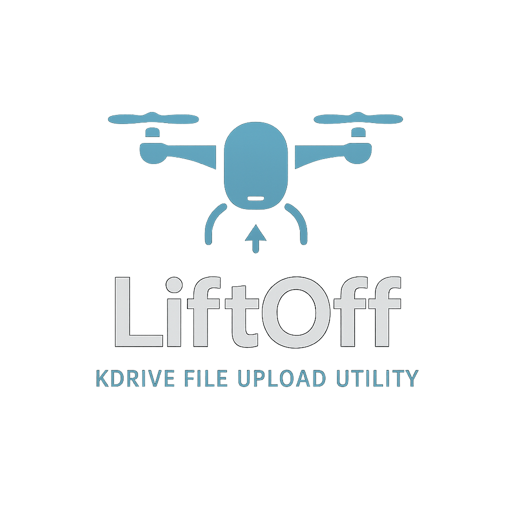

# LiftOff - A Drone Footage Archiving Utility



LiftOff is a Python utility designed to simplify the archiving of drone videos (and metadata) from your local machine  to a specified folder with automatic timestamped organization.

## Features
- Auto-creates daily timestamped directories for archiving
- Handles both individual files and directories
- Generates clean directory structure for drone footage
- Error reporting for failed archiving

## Prerequisites
- Python 3.10 (or higher) 

## Installation

Basically nothing. Just download this repo and as long as you have python installed and can edit the path_to_archive variable you're good to go.<br>
If you want to change the place where the files are archived, go to ```liftoff.py``` and edit ```self.base_path```.<br>self.base_path
If you want to change the subfolder naming, change the naming scheme in ```__get_path()```.

## Usage

1. Edit the configuration to the SD Card path(e.g., `place/holder`)
2. Run the script:
```shell script
python main.py
```
