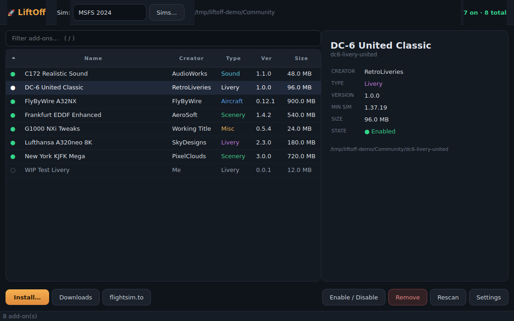
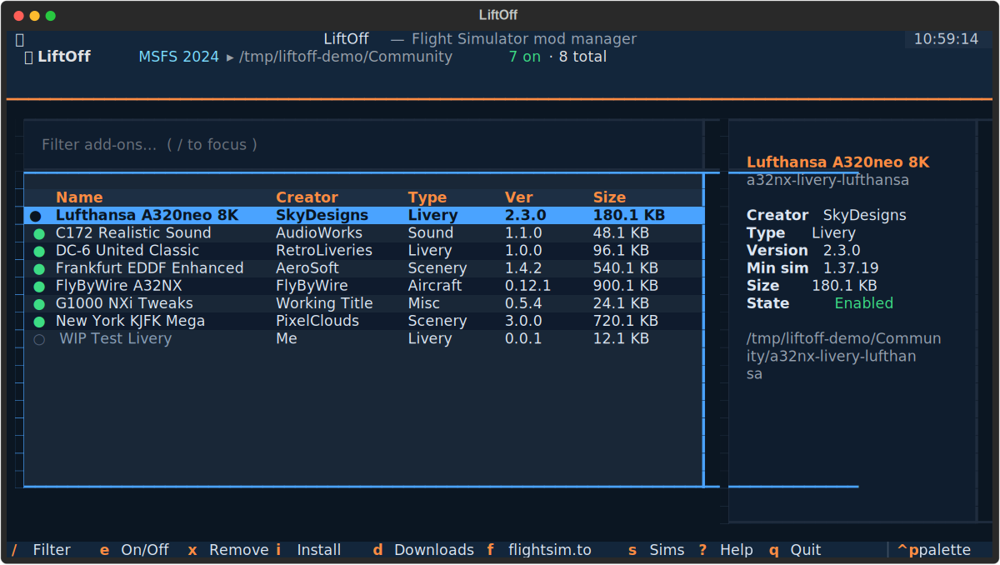

<div align="center">

# 🚀 LiftOff

**A fast, good-looking mod manager for Microsoft Flight Simulator — built for Linux.**

Browse, install and manage your [flightsim.to](https://flightsim.to) add-ons from a native
desktop app (or a snappy terminal UI). No Electron, no bloat — fast to launch, fast to use.



</div>

---

## Why

Running MSFS on Linux (Steam Proton) means the **Community** folder is buried deep inside a
Wine prefix, and every Windows mod manager is a non-starter. LiftOff finds that folder for you
and makes installing, toggling and removing add-ons a one-click (or one-keystroke) affair —
natively, on Linux.

## Features

- **Native desktop GUI** (Qt) — a refined dark "cockpit" theme with color-coded add-on types,
  a sortable table, live filter, rich details panel and one-click actions. Plus a full
  **terminal UI** (`liftoff --tui`) for SSH or keyboard purists.
- **Auto-detects your sim** — locates the MSFS 2020 & 2024 Community folder inside Steam/Proton
  prefixes by reading `UserCfg.opt` (`InstalledPackagesPath`), including relocated installs and
  extra Steam libraries. Add any folder manually (X-Plane, custom, etc.).
- **One-click add-on management** — enable/disable and remove without touching a file manager.
  Nothing is destructive: disabled packages move to a managed store, removed ones to a
  recoverable trash.
- **Smart install from archives** — point LiftOff at a `.zip` / `.rar` / `.7z` and it finds the
  package(s) inside (`manifest.json`), no matter how they're nested, and drops them in the right
  place.
- **Downloads watcher** — see add-on archives sitting in your Downloads folder and install them
  instantly.
- **flightsim.to integration** — search and open flightsim.to right from the app; with your own
  API token, search in-app too.
- **Built for speed** — native C extraction (libarchive / `bsdtar` / `unzip`), same-filesystem
  installs that are atomic *renames* instead of multi-GB copies, instant library sizing from each
  add-on's manifest, and parallel scanning. Long operations never block the UI.

> **Prefer the keyboard or working over SSH?** LiftOff ships a full terminal UI too — run
> `liftoff --tui`. On a headless machine it's selected automatically.
>
> 

## Install

LiftOff needs **Python 3.10+**. The easy way:

```bash
git clone https://github.com/NilsBriggen/LiftOff.git
cd LiftOff
./install.sh          # uses uv, pipx, or pip — whichever you have
```

Or pick your tool directly:

```bash
uv tool install .     # recommended — fast, isolated
pipx install .        # also great
pip install --user .  # classic
```

Then just run:

```bash
liftoff          # desktop GUI
liftoff --tui    # terminal UI
```

> **Archive support:** `.zip` works out of the box (via the native `libarchive` /
> `unzip`). For `.rar` / `.7z` also install `libarchive-tools`, `p7zip-full`, or `unar`
> (e.g. `sudo apt install libarchive-tools p7zip-full`).

## Usage

Launch `liftoff` and you'll land on your add-on library — click the buttons, or use the
same keyboard shortcuts in both the GUI and the TUI:

| Key | Action                          | Key | Action                  |
| --- | ------------------------------- | --- | ----------------------- |
| `/` | Filter add-ons                  | `d` | Install from Downloads  |
| `e` | Enable / disable selected       | `f` | Browse flightsim.to     |
| `x` | Remove selected (to trash)      | `s` | Switch / detect sims    |
| `i` | Install from an archive file    | `,` | Settings                |
| `r` | Rescan library                  | `?` | Help (TUI) · `q` Quit   |

### First run

If LiftOff doesn't auto-detect your sim, press `s` → **Auto-detect**, or **Add folder…** and
paste the path to your Community folder. On Steam/Proton it typically lives at:

```
~/.steam/steam/steamapps/compatdata/<appid>/pfx/drive_c/users/steamuser/
    AppData/Roaming/Microsoft Flight Simulator 2024/Packages/Community
```

(AppID `1250410` for MSFS 2020, `2537590` for MSFS 2024.)

### Scriptable

The same engine works headless, handy for automation:

```bash
liftoff detect                                  # show detected sims
liftoff list --size                             # list installed add-ons
liftoff install ~/Downloads/cool-livery.zip     # install into the active sim
liftoff install mod.zip --community /path/to/Community
```

## flightsim.to integration

flightsim.to is the home of free MSFS add-ons. Its download flow is JavaScript/Cloudflare-gated
and the one-click installer is a Premium feature, so LiftOff integrates the robust way:

1. **Browse** — press `f` to search flightsim.to or jump to a category in your browser.
2. **Download** the add-on as usual.
3. **Install** — press `d` and LiftOff installs it straight from your Downloads folder.

If you have a flightsim.to **API token**, paste it in Settings (`,`) to enable in-app search.

## How it works

LiftOff manages the Community folder directly — the same thing the sim reads on startup.

- **Enable/disable** moves a package between the Community folder and
  `~/.local/share/liftoff/disabled/<sim>/`.
- **Remove** moves a package to `~/.local/share/liftoff/trash/<sim>/` (recoverable).
- **Config** lives in `~/.config/liftoff/config.json`.

Everything is standard XDG; uninstalling LiftOff leaves your add-ons untouched.

## Development

```bash
uv run --extra dev pytest        # run the test suite (GUI tests run headless)
uv run --extra dev ruff check .  # lint
python -m liftoff --tui          # run the TUI from source
```

The GUI needs the usual Qt runtime libraries, which every desktop already has. On a
minimal/headless box add e.g. `libegl1 libgl1 libxkbcommon0` (Debian/Ubuntu) — the test
suite runs Qt with the `offscreen` platform, so no display is required.

## License

[MIT](LICENSE) © Nils Briggen
